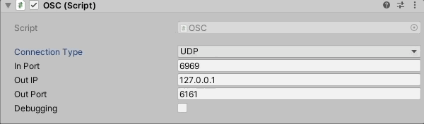

# Easy OSC

### How to use : *osc_unity*

Create an empty object with component OSC (Assets/Scripts/OSC/OSC.cs)

Setup *connection type* 

- UPD for standard osc communication (*In Port* + *Out Port* : must be different)

- WebSocket for webBrowser/websocket osc communication (*In Port* & *Out Port* : are the same)

*Out IP* 127.0.0.1 for local communication

Debugging checkbox let this scripts to log all message (Address + values)  into the Console.




###### Recieve :

The component Receive Position (Assets/Scripts/ReceivePosition.cs) contains all the code needed to Receive data.

```csharp
public class ReceivePosition : MonoBehaviour {
    public OSC osc;
    ...
    void Start(){
        osc.SetAddressHandler("/cube/x", OnReceiveX);
        ...
    }

    void OnReceiveX(OscMessage message)
    {
        Vector3 position = transform.position;
        position.x = message.GetFloat(0);
        transform.position = position;
    }
    ...
```

###### Send :

The component Receive Position (Assets/Scripts/ReceivePosition.cs) contains all the code needed to Send data.

```csharp
...
    OscMessage msg = new OscMessage();
    msg.address = "/cursor";
    msg.values.Add(Input.mousePosition.x);
    msg.values.Add(Input.mousePosition.y);
    osc.Send(msg);
...
```


### How to use : *osc_webSocket*

Drop index.html into your webBrowser, 

Run your Unity application

Setup *IP* *<u>Default</u> : 127.0.0.1*

Setup *PORT* for communication IN & OUT *<u>Default</u> : 6969*

Click *Connect*

###### Send :

You just have to setup html for sending data 

```html
<input type=ANY name=OSC.ADDRESS/>
```

```html
<li>
    <label for="title">Title : </label>
    <input id="title" type="text" name="/title"/>
</li>
<li>
    <label for="cube_x">Cube X : </label>
    <input id="cube_x" type="range" min="-5" max="5" step="0.1" name="/cube/x"/>
    <span></span><!-- if present, this span will automatically display the value of the input -->
</li>
```

###### Recieve :

Just implement this script into a new javascript file.

this is already present into scripts/sketch.js

```javascript
docReady(function(){
    oscPort.on("message", onMessage);    
});

function onMessage(oscMsg) {
	console.log("An OSC message just arrived!", oscMsg);
}
```


### How to use : *osc_udp*

It's a processing (Java) implementation of OSC.

Open osc_udp.pde with Processing,

Run your Unity application

Setup *IN PORT*  *<u>Default</u> : 6161*

Setup *IP* for local communication *<u>Default</u> : 127.0.0.1*

Setup *OUT PORT* *<u>Default</u> : 6969*

Run your processing sketch

```processing
...
/* start oscP5, listening for incoming messages at port 6161 */
oscP5 = new OscP5(this, 6161);
/* start oscP5, outgoing messages at port 6969 */
myRemoteLocation = new NetAddress("127.0.0.1", 6969);
```

###### Send :

```processing
 OscMessage myMessage = new OscMessage("/cube/x"); /* setup the address to send message */
 myMessage.add(random(10)); /* add an int or float to the osc message */
 oscP5.send(myMessage, myRemoteLocation); 
```

###### Recieve :

```processing
/* incoming osc message are forwarded to the oscEvent method. */
void oscEvent(OscMessage theOscMessage) {
  /* print the address pattern and the typetag of the received OscMessage */
  print("### received an osc message.");
  print(" origine: "+theOscMessage.netAddress());
  println(" addrpattern: "+theOscMessage.addrPattern());
  println((char)(theOscMessage.getTypetagAsBytes()[0]));
  //println(" value: "+theOscMessage.get(0).intValue());
  //println(" value: "+theOscMessage.get(0).floatValue());
}
```

### Dependencies

- Unity : 
  
  - [GitHub - sta/websocket-sharp: A C# implementation of the WebSocket protocol client and server](https://github.com/sta/websocket-sharp)
  
  - Custom version of [GitHub - thomasfredericks/UnityOSC: Open Sound Control (OSC) for Unity](https://github.com/thomasfredericks/UnityOSC)
  
  - [GitHub - Deadcows/MyBox: MyBox is a set of attributes, tools and extensions for Unity](https://github.com/Deadcows/MyBox)

- Browser : 
  
  - [GitHub - colinbdclark/osc.js: An Open Sound Control (OSC) library for JavaScript that works in both the browser and Node.js](https://github.com/colinbdclark/osc.js)

- Processing : 
  
  - [GitHub - sojamo/oscp5: An Open Sound Control (OSC) implementation for Java and Processing](https://github.com/sojamo/oscp5)


