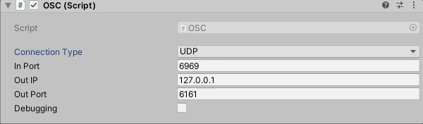

# Easy OSC

## Unity

This piece of code is written in Unity (C#), you could find into oscUnity folders all the code needed. To run this code install [Unity](), then drop Assets/Scripts/* into your Assets. It use dependencies [MyBox](https://github.com/Deadcows/MyBox), [websocket-sharp](https://github.com/sta/websocket-sharp), a custom version of [UnityOSC](https://github.com/thomasfredericks/UnityOSC) (you'll find these dependencies into the libraries folder.).

Create an empty object with component OSC (Assets/Scripts/OSC/OSC.cs)


### udp

### ws


Setup *connection type* 

- UPD for standard osc communication (*In Port* + *Out Port* : must be different)

- WebSocket for webBrowser/websocket osc communication (*In Port* & *Out Port* : are the same)

*Out IP* 127.0.0.1 for local communication

Debugging checkbox let this scripts to log all message (Address + values)  into the Console.




#### Read :

The component Receive Position (Assets/Scripts/ReceivePosition.cs) contains all the code needed to Receive data.

```csharp
public class ReceivePosition : MonoBehaviour {
    public OSC osc;
    ...
    void Start(){
        osc.SetAddressHandler("/cube/x", OnReceiveX);
        ...
    }

    void OnReceiveX(OscMessage message)
    {
        Vector3 position = transform.position;
        position.x = message.GetFloat(0);
        transform.position = position;
    }
    ...
```

#### Send :

The component Receive Position (Assets/Scripts/ReceivePosition.cs) contains all the code needed to Send data.

```csharp
...
    OscMessage msg = new OscMessage();
    msg.address = "/cursor";
    msg.values.Add(Input.mousePosition.x);
    msg.values.Add(Input.mousePosition.y);
    osc.Send(msg);
...
```

#### Troubleshooting Unity 2020...

This error may occure on Unity 2020

> Deterministic compilation failed. You can disable Deterministic builds in Player Settings
> Assets\Scripts\OSC\OscPacket\websocket-sharp\AssemblyInfo.cs(20,28): error CS8357: The specified version string contains wildcards, which are not compatible with determinism. Either remove wildcards from the version string, or disable determinism for this compilation

**Solution : **

Go to *<u>Project Settings</u>* pannel, into the *<u>Player</u>* sub-menu uncheck *<u>Use Deterministic Compilation</u>*
