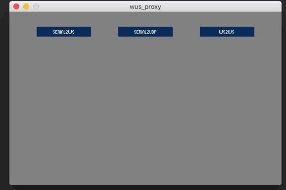
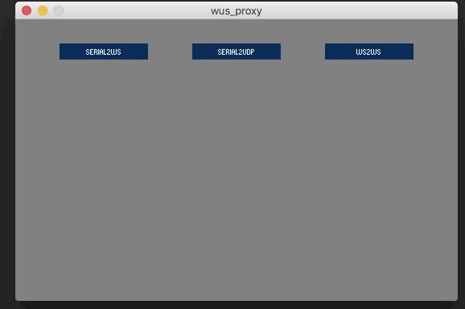

Easy OSC

## wusProxy

wusProxy is a Proxy. It convert communications between Serial, Websocket and UDP. This piece of code is written in Processing (Java), you could find into wus_proxy folder all the code needed. To run this code install [Processing](http://processing.org), then install dependencies [oscP5](), [udp](), [controlp5]() and [webSockets]() (you'll find these dependencies into the libraries folder).

_oscP5_ Library, _udp_ Library, _controlp5_ Library and _webSockets_ Library may be found in the libraries directory. Drop the _udp_ directory, _oscP5_ directory_, _webSockets_ directory and _controlP5_ directory into ```$HOME/Documents/Processing/libraries```. Then restart processing.

> Si deux personnes qui ne parlent pas la même langue veulent communiquer, elles ont besoin d'un interprète. En informatique, deux entités utilisant des technologies différentes peuvent communiquer entre elles grâce à un intermédiaire qui interprète leurs échanges, un proxy.

Open wus_proxy.pde with processing IDE, then click Play button.



### Serial2ws

Select Serial Port, it identifies your Arduino.

Select BaudRate, it lets machines to communicate at this frequency.

Setup PortNumber, it will run a Web Socket on this port number.

Then press start.


The left black square turns white when wusProxy receive message from Arduino

The right black square turns white when wusProxy receive message on Web Socket Server.

These message will be automatically transfered from left to right and from right to left 

### Serial2udp

Select Serial Port, it identifies your Arduino.

Select BaudRate, it lets machines to communicate at this frequency.

Setup IncommingPortNumber, it will receive UDP request from this port number.

Setup OutGoingPortNumber, it will send UDP request on this port number.

Then press start.



The left black square turns white when wusProxy receive message from Arduino

The right black square turns white when wusProxy receive UDP message.

These messages will be automatically transfered from left to right and from right to left

### ws2ws

Setup PortNumber, it will run a Web Socket on this port number.

Then press start. It will start a webSocket server, it will broadcast any message to all clients except the original sender.


The left black square turns white when wusProxy receive message from Client

The right black square turns white when wusProxy send message to Clients

These messages will be automatically transfered from left to right and from right to left
